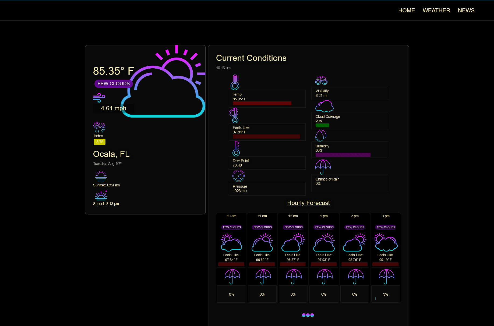

# My Dash

  

# Screenshot

# Description

My Dash is a web app that provides ad-free weather and news for free! IF you are like me you like to start your morning with a cup of coffe, the weather, and some news. Live weather is returned automatically, location details calculated by the ip address. My Dash uses the openweather API for up to date, and accurate weather information. News stories are updated every hour. Pages are dynamically rendered using express-handlebars.

# Table of Contents

- [Demo](#demo)
- [Technology](#technology)
- [Features](#features)
- [Installation](#installation)
- [Usage](#usage)
- [Questions](#questions)
- [License](#license)

# Demo

[DEMO: My Dash](https://drive.google.com/file/d/1S0he35h0IuGchfzb88Y6X4t-bEFETOW-/view)

# Technology

| Technology                                                                                                | Description            | Links ↘️ |
| --------------------------------------------------------------------------------------------------------- | ---------------------- | -------- |
|  | Handlebars             |      |
|  | JavaScript             |      |
|          | Cascading Style Sheets |      |

# Features

My Dash is an ad-free weather and news application.
Location data is captured on the server and current weather is returned automatically from the homepage.
News Stories are updated every hour.
The weather reports provide with daily weather including an hour-by-hour outlook for the next 12 hours, and a 7 day weekly forecast.

# Installation

Project Repository: [My Dash](https://github.com/iiTONELOC/dashboard)  
If you wish to install this project locally please clone the repo, link is above.  
Upon cloning, from the root run `npm i` to install the packages.  
The server can be started by running `node server`

# Usage

[My Dash](https://i-dash.herokuapp.com/)

# Questions

Feel free to reach out if you have any questions

Contact via GitHub: [iiTONELOC](https://github.com/iiTONELOC)  
Send an email: [anthonytropeano@protonmail.com](mailto:anthonytropeano@protonmail.com)

# License

MIT License

        Copyright (c) 2021 Anthony Tropeano

        Permission is hereby granted, free of charge, to any person obtaining a copy
        of this software and associated documentation files (the "Software"), to deal
        in the Software without restriction, including without limitation the rights
        to use, copy, modify, merge, publish, distribute, sublicense, and/or sell
        copies of the Software, and to permit persons to whom the Software is
        furnished to do so, subject to the following conditions:

        The above copyright notice and this permission notice shall be included in all
        copies or substantial portions of the Software.

        THE SOFTWARE IS PROVIDED "AS IS", WITHOUT WARRANTY OF ANY KIND, EXPRESS OR
        IMPLIED, INCLUDING BUT NOT LIMITED TO THE WARRANTIES OF MERCHANTABILITY,
        FITNESS FOR A PARTICULAR PURPOSE AND NONINFRINGEMENT. IN NO EVENT SHALL THE
        AUTHORS OR COPYRIGHT HOLDERS BE LIABLE FOR ANY CLAIM, DAMAGES OR OTHER
        LIABILITY, WHETHER IN AN ACTION OF CONTRACT, TORT OR OTHERWISE, ARISING FROM,
        OUT OF OR IN CONNECTION WITH THE SOFTWARE OR THE USE OR OTHER DEALINGS IN THE
        SOFTWARE.
